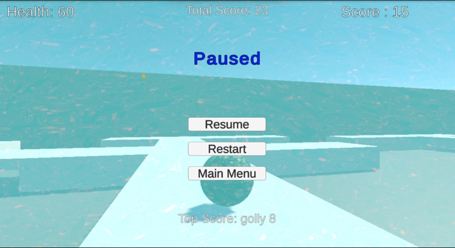
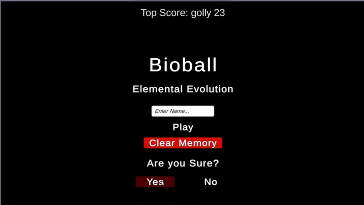

# Bioball

A 3D rolling survival game built in Unity where you control a plant sphere, dodging enemies, collecting gems, and racing to reach the next level.

**Play it now in your browser:**  
[Play Bioball on Unity Play](https://play.unity.com/en/games/3d1ab859-707c-44e6-90b9-8dddc777cf41/bioball)  
 [Play Bioball on itch.io](https://mercurymerc8.itch.io/bioball)

<!--gameplay GIF -->

### Gameplay & Controls
- **Objective**: Roll towards the goal, collect gems for points, avoid enemies, and reach the goal to advance levels.
- **Movement**:
  - **W / Up Arrow** — Roll forward (add force)
  - **S / Down Arrow** — Roll backward
  - **A / D** or **Left / Right Arrows** — Rotate camera / steer
- Enemies chase—survive by outrolling them!
- High score persists between sessions.

### Features
- Clean OOP architecture (polymorphism, inheritance, encapsulation, abstraction)
- Reusable `DamageOverTime` effects decoupled from enemies
- Persistent high score via JSON serialization
- Physics-based rolling movement
- Multiple levels with increasing difficulty
- WebGL build hosted on Unity Play

### Tech Stack
- Unity 6 (6000.2.8f1)
- C#
- Physics-driven gameplay
- Data persistence
- Iterative WebGL deployment

### How to Run Locally
1. Clone: `git clone https://github.com/WGabrielHoward/Bioball.git`
2. Open in Unity Hub (6000.2.f1 or compatible)
3. Load the main scene and press Play!

### Screenshots

### License

This project is open source and available under the [MIT License](LICENSE).

### Credits & Assets
- Ground materials: [Yughues Free Ground Materials](https://assetstore.unity.com/packages/2d/textures-materials/nature/yughues-free-ground-materials-13001) by Nobiax / Yughues  
  Licensed under the Standard Unity Asset Store EULA.
Thank you to the creators for these excellent free resources!

Built by [William G. Howard](https://www.linkedin.com/in/william-g-howard) while studying Game Programming at DePaul University.
